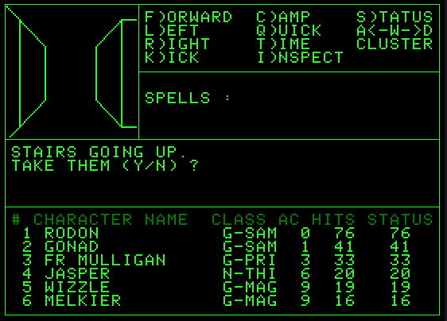
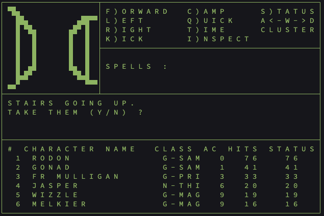
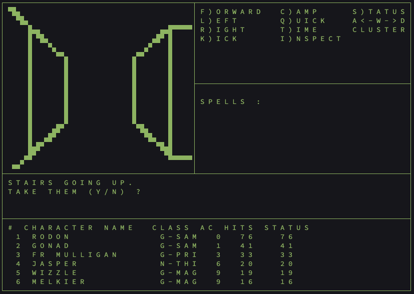
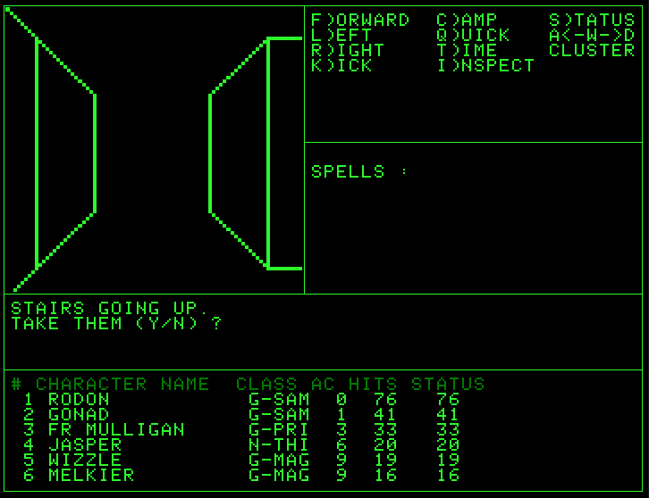
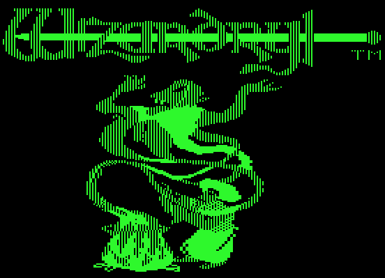

# Wizardry

This project is an homage to the original Apple II Wizardry game that left a lasting mark on my life. Back in the early 1980s, sitting with my cousin Brad, I encountered something that sparked a deep curiosity about how computers worked. That moment led me into programming, grew into a lifetime in IT, and ultimately became a lasting passion for computing itself. Every project I take on today traces back, in some way, to that first experience. This recreation isn't just about preserving a classic—it's about honoring the experience that started it all.

A terminal-based recreation of Wizardry: Proving Grounds of the Mad Overlord (and scenarios 2-3) written in Go. Single binary, no external data files, no runtime dependencies.



## Overview

This is a clean-room implementation of the Wizardry 1-3 game engine for modern terminals. It recreates the original game mechanics, screen layouts, and dungeon rendering as faithfully as possible. All three scenarios share the same engine and data format, and are included in a single binary.

**What this is:**
- A complete, playable Wizardry implementation in Go
- Wireframe 3D dungeon rendering using Unicode characters (or Sixel graphics)
- All original game mechanics: combat, spells, character creation, town, dungeon exploration
- Self-contained binary with all game data embedded

**What this is not:**
- Not an emulator — no Apple II code is executed
- Not a port of existing source code
- No copyrighted material is embedded

## Features

- All three Wizardry scenarios: Proving Grounds of the Mad Overlord, Knight of Diamonds, Legacy of Llylgamyn
- Full character creation with all 5 races, 8 classes, and 3 alignments
- All 50 spells (21 mage + 29 priest) with original effects
- Complete combat system with initiative, monster AI, spell resistance, breath weapons, level drain
- Town locations: Castle, Tavern, Inn, Boltac's Trading Post, Temple, Training Grounds
- Wireframe 3D dungeon view with 5 depth layers
- Save/load game state
- Map overlay (M key)
- Adjustable viewport scaling

## Sixel Graphics Mode

For the best visual experience, use a terminal with Sixel graphics support. Sixel mode renders smooth, high-resolution wireframe dungeon views and the original title screen artwork — a dramatic improvement over standard Unicode block characters.

### Standard Terminal vs Sixel Graphics

| Standard Terminal | Sixel Graphics |
|---|---|
|  |  |
| Unicode half-block characters | Smooth anti-aliased lines |

Sixel mode activates automatically when a compatible terminal is detected.

### Viewport Scaling

Use the `CLUSTER` command (or `V` key) to adjust viewport scale. `VP SCALE = 2` doubles the dungeon viewport size:

| Standard VP Scale | VP Scale = 2 |
|---|---|
|  |  |
|  |  |

### Title Screen (Sixel)



### Compatible Terminals

Terminals with Sixel graphics support:

| Terminal | Platform | Notes |
|----------|----------|-------|
| [WezTerm](https://wezfurlong.org/wezterm/) | macOS, Linux, Windows | Recommended. Full Sixel support out of the box |
| [foot](https://codeberg.org/dnkl/foot) | Linux (Wayland) | Native Sixel support |
| [mlterm](https://github.com/arakiken/mlterm) | Linux, macOS | Native Sixel support |
| [contour](https://github.com/contour-terminal/contour) | Linux, macOS, Windows | Native Sixel support |
| [mintty](https://mintty.github.io/) | Windows (Cygwin/MSYS2) | Native Sixel support |
| xterm | Linux, macOS | Requires `-ti vt340` flag |
| [Windows Terminal](https://github.com/microsoft/terminal) | Windows | Sixel support in recent builds |

If your terminal does not support Sixel, the game falls back to Unicode half-block character rendering automatically.

## Building

Requires Go 1.22 or later.

```bash
# Build
make build

# Or directly
go build -o wizardry ./cmd/wizardry/

# Install to /usr/local/bin
sudo make install

# Uninstall
sudo make uninstall
```

## Usage

```bash
# Run Wizardry 1 (default)
./wizardry wiz1

# Run Wizardry 2: Knight of Diamonds
./wizardry wiz2

# Run Wizardry 3: Legacy of Llylgamyn
./wizardry wiz3
```

## Controls

### Dungeon

| Key | Action |
|-----|--------|
| F / W | Move forward |
| A | Turn left |
| D | Turn right |
| L | Turn left |
| R | Turn right |
| K | Kick door |
| C | Camp menu |
| S | Status screen |
| M | Toggle map overlay |
| Q | Quick plot (fast redraw) |
| I | Inspect (search for characters) |
| T | Set animation delay |
| V | Viewport scale (CLUSTER) |

### Combat

| Key | Action |
|-----|--------|
| F | Fight (melee attack) |
| S | Cast spell |
| P | Parry (defend) |
| R | Run (attempt to flee) |
| U | Use item |
| D | Dispel undead |

### Camp Menu

| Key | Action |
|-----|--------|
| L | Leave camp (return to maze) |
| E | Equip items |
| R | Reorder party |
| D | Disband (return to town) |
| 1-6 | Inspect party member |

### Town Navigation

Navigate town locations by pressing the highlighted letter in each menu option. Use Return to go back.

## Save Files

Game state is saved automatically and stored in `~/.wizardry/` as JSON files. Each scenario has its own save directory.

## License

MIT License. See [LICENSE](LICENSE) for details.
