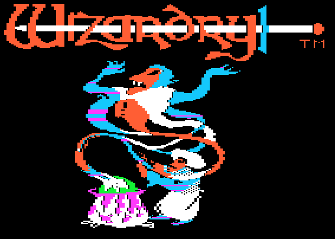

# Wizardry

A terminal-based recreation of Wizardry: Proving Grounds of the Mad Overlord (and scenarios 2-3) written in Go. Single binary, no external data files, no runtime dependencies.


## Overview

This is a clean-room implementation of the Wizardry 1-3 game engine for modern terminals. It recreates the original game mechanics, screen layouts, and dungeon rendering as faithfully as possible. All three scenarios share the same engine and data format, and are included in a single binary.

**Current status:** All three scenarios are playable — Proving Grounds of the Mad Overlord, Knight of Diamonds, and Legacy of Llylgamyn. Each scenario has its own title sequence: Wiz 1 features an animated title with the WT bitmap reveal, Wiz 2 displays the KODIMAGE static title, and Wiz 3 plays through the original 10-frame PICTURE.BITS story sequence with auto-advancing text pages.

**What this is:**
- A complete, playable Wizardry implementation in Go
- Wireframe 3D dungeon rendering using Unicode characters (or Sixel graphics)
- All original game mechanics: combat, spells, character creation, town, dungeon exploration
- Self-contained binary with all game data embedded

**What this is not:**
- Not an emulator — no Apple II code is executed
- Not a port of existing source code
- No copyrighted material is embedded

## Features

- All three Wizardry scenarios: Proving Grounds of the Mad Overlord, Knight of Diamonds, Legacy of Llylgamyn
- Scenario-specific title sequences: Wiz 1 animated WT bitmap, Wiz 2 KODIMAGE, Wiz 3 PICTURE.BITS 10-frame story
- NTSC artifact color mode (`--color`) for all Sixel graphics — title screens, dungeon views, monster images
- Full character creation with all 5 races, 8 classes, and 3 alignments
- Wiz 3 character import with Rite of Passage ceremony (converts Wiz 1/2 characters to descendants)
- All 50 spells (21 mage + 29 priest) with original effects
- Complete combat system with initiative, monster AI, spell resistance, breath weapons, level drain
- Town locations: Castle, Tavern, Inn, Boltac's Trading Post, Temple, Training Grounds
- Wireframe 3D dungeon view with 5 depth layers
- Audible wall collision feedback (terminal bell)
- Save/load game state
- Map overlay (M key)
- Adjustable viewport scaling

## Sixel Graphics Mode

For the best visual experience, use a terminal with Sixel graphics support. Sixel mode renders smooth, high-resolution wireframe dungeon views and the original title screen artwork — a dramatic improvement over standard Unicode block characters.

### Standard Terminal vs Sixel Graphics

| Standard Terminal | Sixel Graphics |
|---|---|
|  |  |
| Unicode half-block characters | Smooth anti-aliased lines |

Sixel mode activates automatically when a compatible terminal is detected.

### Viewport Scaling

Use the `--vpscale` flag to adjust viewport scale. `--vpscale=2` doubles the dungeon viewport size:

| Standard VP Scale | VP Scale = 2 |
|---|---|
|  |  |
|  |  |

### Title Screen (Sixel)

| Monochrome (default) | NTSC Color (`--color`) |
|---|---|
|  |  |

### NTSC Artifact Color Mode

The `--color` flag enables Apple II NTSC artifact color rendering for all Sixel graphics — title screens, dungeon views, and combat monster images. This simulates the color signal artifacts produced by the Apple II's NTSC video output, where pixel patterns on the Hi-Res screen produce characteristic purple, green, blue, and orange fringes.

The color algorithm detects adjacent pixel patterns in the raw Hi-Res framebuffer: lone pixels produce position-dependent color (purple/green for palette 0, blue/orange for palette 1), adjacent ON pixels merge to white, and alternating patterns produce solid color bands.

```bash
# Enable NTSC artifact color
./wizardry --color

# Color mode with scenario 2
./wizardry --scenario=2 --color
```

Without `--color`, all Sixel graphics render in the original green phosphor monochrome, which is the iconic Wizardry look.

### Compatible Terminals

Terminals with Sixel graphics support:

| Terminal | Platform | Notes |
|----------|----------|-------|
| [iTerm2](https://iterm2.com/) | macOS | Native Sixel support |
| [WezTerm](https://wezfurlong.org/wezterm/) | macOS, Linux, Windows | Full Sixel support out of the box |
| [foot](https://codeberg.org/dnkl/foot) | Linux (Wayland) | Native Sixel support |
| [mlterm](https://github.com/arakiken/mlterm) | Linux, macOS | Native Sixel support |
| [contour](https://github.com/contour-terminal/contour) | Linux, macOS, Windows | Native Sixel support |
| [mintty](https://mintty.github.io/) | Windows (Cygwin/MSYS2) | Native Sixel support |
| xterm | Linux, macOS | Requires `-ti vt340` flag |
| [Windows Terminal](https://github.com/microsoft/terminal) | Windows | Sixel support in recent builds |

If your terminal does not support Sixel, the game falls back to Unicode half-block character rendering automatically.

## Building

Requires Go 1.24 or later.

```bash
# Build
make build

# Or directly
go build -o wizardry ./cmd/wizardry/

# Install to /usr/local/bin
sudo make install

# Uninstall
sudo make uninstall
```

## Usage

```bash
# Run Wizardry 1 (default)
./wizardry

# Run Wizardry 2: Knight of Diamonds
./wizardry --scenario=2

# Run Wizardry 3: Legacy of Llylgamyn
./wizardry --scenario=3

# Run with larger viewport (1.5x, 2x, etc.)
./wizardry --vpscale=2

# Enable NTSC artifact color rendering (Sixel terminals only)
./wizardry --color
```

## Controls

### Dungeon

| Key | Action |
|-----|--------|
| F / W | Move forward |
| A | Turn left |
| D | Turn right |
| L | Turn left |
| R | Turn right |
| K | Kick door |
| C | Camp menu |
| S | Status screen |
| M | Toggle map overlay |
| Q | Quick plot (fast redraw) |
| I | Inspect (search for characters) |
| T | Set animation delay |

### Combat

| Key | Action |
|-----|--------|
| F | Fight (melee attack) |
| S | Cast spell |
| P | Parry (defend) |
| R | Run (attempt to flee) |
| U | Use item |
| D | Dispel undead |

### Camp Menu

| Key | Action |
|-----|--------|
| L | Leave camp (return to maze) |
| E | Equip items |
| R | Reorder party |
| D | Disband (return to town) |
| 1-6 | Inspect party member |

### Town Navigation

Navigate town locations by pressing the highlighted letter in each menu option. Use Return to go back.

## Save Files

Game state (roster and party) is saved automatically to `~/.config/wizardry/roster<N>.json` (e.g. `roster1.json` for scenario 1).

## License

MIT License. See [LICENSE](LICENSE) for details.
